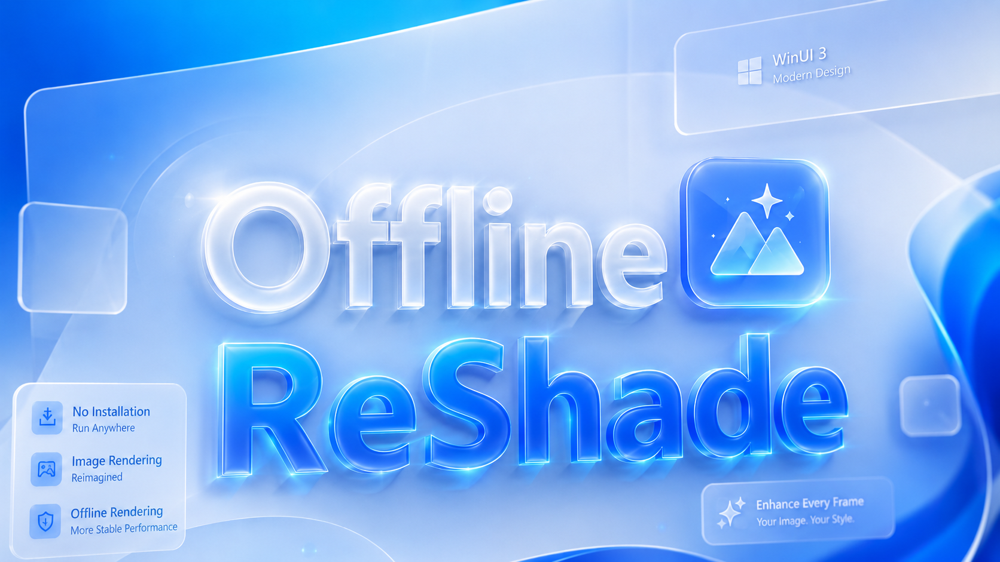

[中文说明](README.zh-CN.md) | English

# Offline ReShade

<p align="center">
  
</p>

Offline ReShade is a Windows tool for applying ReShade FX effects to still
images or exported frame sequences. It is designed for Koikatu (KK) and
Koikatsu Sunshine (KKS) offline capture workflows:

- the game-side plugins export color and depth files;
- `OfflineReShadeWinUI.exe` provides the editing UI;
- `OfflineReShadePrototype.exe` hosts a full-resolution D3D11 ReShade runtime;
- preview is scaled in the UI, while screenshots and batch output use the
  full-resolution runtime.

This repository is based on ReShade, but the release package intentionally does
not include third-party `.fx` or `.fxh` shader resources. Users must select
their own ReShade effect folder in Settings.

## Quick Start For Users

This section is for normal users who downloaded the compiled release packages.
You do not need to build this repository.

Follow the steps in order. Most setup problems come from starting the client
before the game-side color/depth export has been verified.

1. Install the matching compiled game-side Offline ReShade plugin package.
2. Start the game once and use the plugin hotkey/export command to generate a
   test capture.
3. Confirm that the game has written both color and depth files:
   - Real Time output folder:
     `UserData\cap\OfflineReShade\`
   - Required files:
     `coloroutput.png`, `depthoutput.rfloat`, and `metadata.json`
4. Extract the Offline ReShade client release package anywhere outside the game
   folder.
5. Put your ReShade shader library into the client package `Effects` folder, or
   prepare your own external shader folder.
6. Run `OfflineReShadeWinUI.exe`.
7. Open `Settings`.
8. Select `Game`: `KKS` or `KK`.
9. Configure the Real Time paths:
   - `Color PNG`: the exported `coloroutput.png`.
   - `Depth File`: the exported `depthoutput.rfloat`.
   - `Output PNG`: where the final Real Time render should be saved.
10. Configure the Gallery paths if you want batch/still-frame editing:
    - `Gallery Input Folder`: folder containing exported color/depth pairs.
    - `Gallery Output Folder`: folder where final renders should be written.
11. Configure ReShade resources:
    - `Effect Folder`: use the package `Effects` folder if you copied shaders
      there, or choose your own shader folder.
    - `Preset INI`: leave blank for the safest first run, or choose your own
      preset after the basic workflow is confirmed.
12. Click `Start Preview`.
13. Enable effects and adjust parameters in `ReShade Controls`.
14. Click `ReShade Shot` to save the current full-resolution result.

The clean release package should include the application binaries and runtime
DLLs, but should not include:

- `.fx` / `.fxh` shader files;
- paid or private ReShade presets;
- local user settings;
- ReShade logs;
- PDB/import-library developer files.

If you have these, it means you are using a redistributed version from some unreliable source, delete it and re-download it from github.

## Required Game Plugins

Offline ReShade does not capture the game by itself. The game must export
matching color and depth files first.

Install BepInEx 5 and the normal BepisPlugins dependencies for your game, then
install the matching Offline ReShade plugin DLLs into `BepInEx\plugins`.

For the complete still-image and VideoExport workflow, check that the companion
plugin package provides these three DLL roles:

1. Screencap/ScreenshotManager:
   - KK: `Screencap.dll`
   - KKS: `KKS_Screencap.dll`
   - KK has two Screencap package variants:
     - `KK Stable Path`: lighter D3D11 bridge path. Try this first.
     - `KK Compatibility Bridge`: rehooks and repairs D3D11 context hooks across
       captures. Use this if the stable package opens normally but does not
       generate `depthoutput.rfloat`, only captures depth for the first image, or
       intermittently misses VideoExport depth frames.
   - Do not mix the KK stable `Screencap.dll` with the compatibility bridge DLL,
     or the compatibility `Screencap.dll` with the stable bridge DLL. Install the
     matched pair from the same release package.
2. KK native depth bridge:
   - `OfflineDepthD3D11Bridge.dll`
   - Required for KK high-quality D3D11 device depth.
   - Put it next to `Screencap.dll`, or set its absolute path in
     `Offline ReShade Export > D3D11 bridge DLL path`.
   - KKS does not use this bridge.
3. VideoExport integration:
   - KK: `VideoExport.dll` from the KK build.
   - KKS: `VideoExport.dll` from the KKS build.

If one of these DLLs is missing or mismatched, the client may still open, but
real-time capture, gallery depth, or video frame export will not work correctly.

## Game-Side Export

### Real Time Export

In-game, press the Offline ReShade export hotkey from the modified
ScreenshotManager/Screencap plugin. The default hotkey is:

```text
LeftCtrl + F10
```

The default real-time handoff folder is:

```text
UserData\cap\OfflineReShade\
  coloroutput.png
  depthoutput.rfloat
  metadata.json
```

The WinUI client watches these files in Real Time mode. When the plugin writes a
new color/depth pair, the native ReShade runtime reloads the input without
restarting the effects runtime.

### Gallery Export

Enable archive output in the Screencap plugin to save timestamped still-image
pairs in the normal screenshot folder:

```text
UserData\cap\CharaStudio-YYYY-MM-DD-HH-MM-SS-Color.png
UserData\cap\CharaStudio-YYYY-MM-DD-HH-MM-SS-Depth.rfloat
```

Gallery mode also supports the VideoExport frame naming convention:

```text
UserData\VideoExport\Frames\<timestamp>\
  0.png
  0.depth.rfloat
  1.png
  1.depth.rfloat
  metadata.json
```

Gallery output files are named:

```text
CharaStudio-YYYY-MM-DD-HH-MM-SS-Reshade.png
0-Reshade.png
1-Reshade.png
```

The output folder is configured separately from the real-time temporary folder.

## Using the Client

### Before Opening The Client

Offline ReShade is not a screen capture tool by itself. The game-side plugin
must export matching color and depth files first.

Before configuring the client, check these files exist:

```text
<GameFolder>\UserData\cap\OfflineReShade\
  coloroutput.png
  depthoutput.rfloat
  metadata.json
```

Open `coloroutput.png` in an image viewer to confirm it is the image you want to
process. Do not worry if `depthoutput.rfloat` cannot be opened by an image
viewer; it is raw depth data for the client.

If these files are missing, fix the game plugin installation first. Starting the
client before color/depth export works will only lead to empty previews or
missing effects.

### First Client Setup

Open `Settings` before starting preview.

Set these fields carefully:

- `Game`: choose `KKS` for Koikatsu Sunshine or `KK` for Koikatu.
- `Color PNG`: select `UserData\cap\OfflineReShade\coloroutput.png`.
- `Depth File`: select `UserData\cap\OfflineReShade\depthoutput.rfloat`.
- `Output PNG`: choose where the final Real Time render should be saved.
- `Effect Folder`: choose the folder containing your ReShade `.fx` and `.fxh`
  files.
- `Preset INI`: optional. Leave blank for the first successful test.
- `Gallery Input Folder`: folder containing archived stills or video frames.
- `Gallery Output Folder`: folder for finished Gallery/Batch renders.
- `Render Width` / `Render Height`: leave blank unless you intentionally want a
  different final render size.

The release package contains an `Effects` folder for convenience. The default
setting points there. Copy your shader library into that folder if you want to
use the default path. You may also choose any external ReShade shader folder.

The app stores separate path sets for KK and KKS. Switching `Game` restores the
last paths used for that game.

### Effects And Presets

For the safest first run:

1. Put only a small known-good shader set in `Effects`.
2. Leave `Preset INI` blank.
3. Start preview.
4. Enable one simple effect in `ReShade Controls`.
5. Confirm the preview changes.

After this works, you can use your own full shader library and preset.

Using an existing preset from another game or ReShade installation can carry
over old settings. That may cause depth-dependent effects to look inverted,
upside down, too bright, too dark, or completely black. If that happens, first
test with `Preset INI` blank, then rebuild the preset inside Offline ReShade and
click `Save Preset`.

### Real Time Mode

Use Real Time mode when the game plugin repeatedly updates the fixed handoff
files:

```text
UserData\cap\OfflineReShade\coloroutput.png
UserData\cap\OfflineReShade\depthoutput.rfloat
```

Recommended workflow:

1. In game, export one test frame.
2. In the client, select `Real Time` on the top bar.
3. Confirm `Settings` points to the exported `coloroutput.png` and
   `depthoutput.rfloat`.
4. Click `Start Preview`.
5. Enable techniques and adjust uniforms in `ReShade Controls`.
6. Export another frame in game when you want to edit a new shot.
7. The preview updates without restarting the ReShade runtime.
8. Click `ReShade Shot` to save the current full-resolution render to
   `Output PNG`.

`ReShade Shot` is the normal final-output button. It saves the current
full-resolution runtime result and does not include the WinUI controls.

### Gallery Mode

Use Gallery mode to edit archived still images or VideoExport frame sequences.

Supported still-image naming:

```text
CharaStudio-YYYY-MM-DD-HH-MM-SS-Color.png
CharaStudio-YYYY-MM-DD-HH-MM-SS-Depth.rfloat
```

Supported video-frame naming:

```text
0.png
0.depth.rfloat
1.png
1.depth.rfloat
```

Recommended workflow:

1. Open `Settings`.
2. Set `Gallery Input Folder` to the folder containing the color/depth pairs.
3. Set `Gallery Output Folder` to a separate folder for final renders.
4. Select `Gallery` on the top bar.
5. Click `Refresh` in the Gallery panel.
6. Click a thumbnail to load that item into the existing runtime.
7. Adjust effects and parameters.
8. Click `ReShade Shot` to save only the selected item.

Gallery output names are generated automatically:

```text
CharaStudio-YYYY-MM-DD-HH-MM-SS-Reshade.png
0-Reshade.png
1-Reshade.png
```

### Batch Apply

`Batch Apply` applies the current ReShade settings to every valid Gallery item.

Use it after you have already tested one item manually:

1. Select `Gallery`.
2. Click `Refresh`.
3. Click one representative thumbnail.
4. Adjust effects until the preview looks correct.
5. If the effect uses temporal accumulation, path tracing, denoising, or history
   buffers, increase `Frame Delay`.
6. Click `Batch Apply`.

`Frame Delay` is the number of frames to wait after switching to the next
gallery item before saving it. Use a higher value for effects that need time to
settle. Use a lower value for simple color-only effects.

## Depth Profiles

### KKS

KKS uses the ScreenshotManager camera render path and exports depth at the final
color size. KKS does not use client-side depth downsampling.

Current preferred depth format:

```text
depthoutput.rfloat
encoding: rfloat32_device_depth_little_endian
row order: bottom_to_top
value: Unity/D3D device depth, not linear depth
```

Legacy packed PNG depth can still be selected when needed:

```text
depthoutput.png
encoding: rgba8_unorm_32_device_depth
```

### KK

KK uses `OfflineDepthD3D11Bridge.dll` to read D3D11 device depth directly from
the render path. KK depth is always raw `.rfloat`.

The KK bridge may output depth at the color size or at 2x resolution. When 2x
depth is detected, the native runtime downsamples it once when the file is
loaded or hot-swapped, then reuses the uploaded `R32_FLOAT` depth texture every
frame.

Available KK downsample filters:

- `Max 2x2`: default, preserves foreground for reversed-Z depth.
- `Smooth Box 2x2`: average filter, smoother but can mix foreground/background
  at edges.

## Architecture

```text
Game plugin
  -> color/depth/metadata files
  -> OfflineReShadeWinUI.exe
  -> OfflineReShadePrototype.exe
  -> ReShade64.dll full-resolution D3D11 runtime
  -> GPU shared texture preview + full-resolution screenshot/output
```

Main components:

- `OfflineReShadeWinUI`: WinUI 3 UI, settings, gallery, batch apply, and
  ReShade controls.
- `OfflineReShadePrototype`: native D3D11 host process that owns the ReShade
  runtime, input textures, screenshot output, and frame loop.
- Named pipe JSON-RPC: real-time control channel from WinUI to native runtime.
  Techniques, uniforms, preset saving, screenshots, and input hot-swaps are
  applied directly to the live runtime rather than by editing a preset and
  reloading.
- `OfflineReShadePreviewBridge.dll`: GPU preview bridge used to show the
  full-resolution runtime in the WinUI panel without CPU readback.
- `ReShade64.dll`: modified ReShade runtime used by the native host.

The preview panel may be zoomed and panned, but it does not change the ReShade
runtime size. `BUFFER_WIDTH` and `BUFFER_HEIGHT` stay at the selected render
resolution, so screenshots and batch output are full resolution.

## ReShade Effects and Presets

Effects are user supplied. Set `Effect Folder` to a folder containing ReShade
`.fx` and `.fxh` files.

The clean release package intentionally does not ship shader packs. This avoids
redistributing paid/private shaders and keeps licensing separate from the
application.

Preset changes made through the UI are applied live. Use `Save Preset` when you
want to persist the current technique and uniform state.

## Building

Requirements:

- Windows
- Visual Studio 2022
- Windows App SDK dependencies restored by NuGet
- x64 build target

Build the main release targets with Visual Studio MSBuild:

```powershell
& "C:\Program Files\Microsoft Visual Studio\2022\Enterprise\MSBuild\Current\Bin\amd64\MSBuild.exe" OfflineReShadePrototype.vcxproj /p:Configuration=Release /p:Platform=x64 /m
& "C:\Program Files\Microsoft Visual Studio\2022\Enterprise\MSBuild\Current\Bin\amd64\MSBuild.exe" OfflineReShadeWinUI\OfflineReShadeWinUI.csproj /p:Configuration=Release /p:Platform=x64 /m
```

Runtime output is written to:

```text
bin\x64\Release\
```

For distribution, copy the release output but exclude local settings, logs,
debug symbols, import libraries, and any `.fx` / `.fxh` shader resources.

## Troubleshooting

- Client opens but preview does not update:
  - confirm the game plugin is writing `coloroutput.png`, depth, and
    `metadata.json`;
  - confirm `Game` is set to the correct profile;
  - confirm the depth file format matches the selected game.
- KK depth is empty or low quality:
  - confirm `OfflineDepthD3D11Bridge.dll` is installed next to
    `Screencap.dll`, or configured by absolute path;
  - check the game log for bridge diagnostics.
- Gallery items are missing:
  - confirm each color image has a matching depth file;
  - supported still naming is `*-Color.png` + `*-Depth.rfloat`;
  - supported video naming is `<frame>.png` + `<frame>.depth.rfloat`.
- Effects do not appear:
  - confirm `Effect Folder` points to your shader folder;
  - the release package does not include shaders by design.

## License

This project is based on ReShade. ReShade is licensed under the terms of the
[BSD 3-clause license](LICENSE.md). Some ReShade source files are dual-licensed
under MIT where stated in their file headers.
